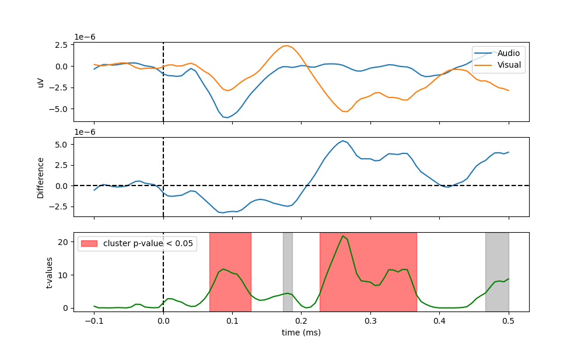
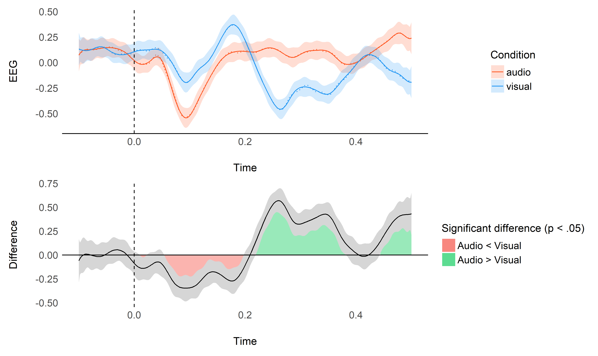
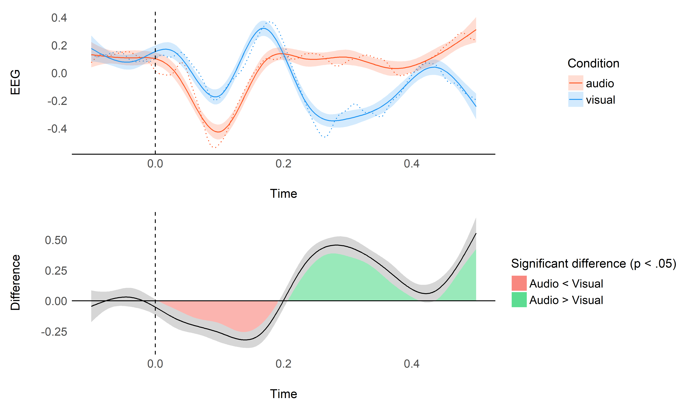
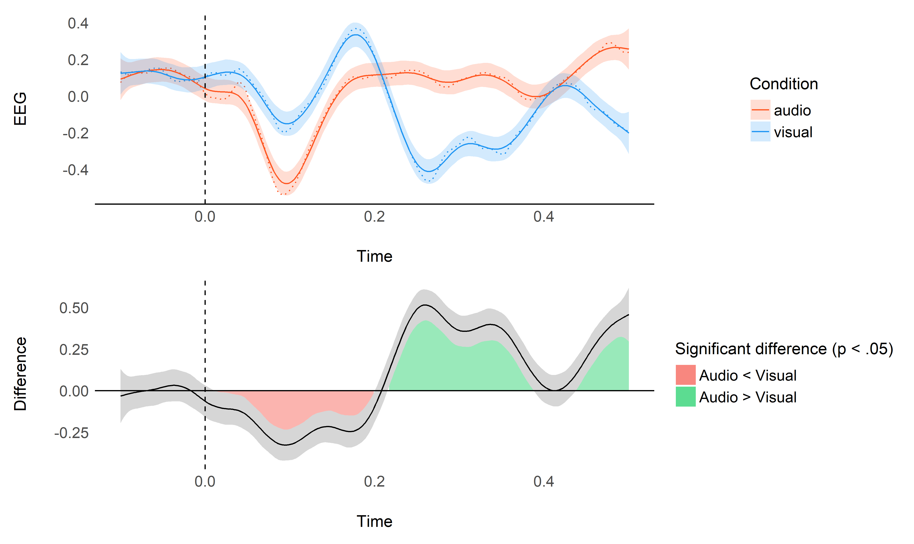

# An GAM-based Approach to EEG/ERP Analysis using Python and R

*This study can be referenced by* [citing the
package](https://github.com/neuropsychology/NeuroKit#citation).

**We’d like to publish this study, but unfortunately we currently don’t
have the time. If you want to help to make it happen, please contact
us\!**

## Introduction

The aim of this study is to show how to analyze event-related potentials
(ERP), i.e., evoked potentials under a regression framework, for
instance by using Bayesian General Additive Models (GAM).

## Procedure

### Data

``` python
import numpy as np
import pandas as pd
import neurokit2 as nk
import matplotlib.pyplot as plt
import mne

# Download example dataset
raw = mne.io.read_raw_fif(mne.datasets.sample.data_path() + '/MEG/sample/sample_audvis_filt-0-40_raw.fif')
events = mne.read_events(mne.datasets.sample.data_path() + '/MEG/sample/sample_audvis_filt-0-40_raw-eve.fif')

# Create epochs including different events
event_id = {'audio/left': 1, 'audio/right': 2,
            'visual/left': 3, 'visual/right': 4}

# Create epochs (100 ms baseline + 500 ms)
epochs = mne.Epochs(raw, 
                    events,
                    event_id,
                    tmin=-0.1,
                    tmax=0.5,
                    picks='eeg',
                    preload=True,
                    detrend=0,
                    baseline=(None, 0))

# Generate list of evoked objects from conditions names
evoked = [epochs[name].average() for name in ('audio', 'visual')]

# Plot topo
mne.viz.plot_compare_evokeds(evoked, picks='eeg', axes='topo')
## [<Figure size 1800x1400 with 60 Axes>]
plt.savefig("figures/fig1.png")
plt.clf()

# Select subset of frontal electrodes
picks = ["EEG 001", "EEG 002", "EEG 003",
         "EEG 005", "EEG 006",
         "EEG 010", "EEG 011", "EEG 012", "EEG 013", "EEG 014"]
epochs = epochs.pick_channels(picks)
                    
# Downsample
epochs = epochs.resample(sfreq=150)

# Convert to data frame and save
nk.mne_to_df(epochs).to_csv("data.csv", index=False)
```


### ERP analysis using MNE-Python

``` python
# Transform each condition to array
condition1 = np.mean(epochs["audio"].get_data(), axis=1)
condition2 = np.mean(epochs["visual"].get_data(), axis=1)

# Permutation test to find significant cluster of differences
t_vals, clusters, p_vals, h0 = mne.stats.permutation_cluster_test([condition1, condition2], out_type='mask', seed=111)

# Visualize
## <string>:1: RuntimeWarning: Ignoring argument "tail", performing 1-tailed F-test
fig, (ax0, ax1, ax2) = plt.subplots(nrows=3, ncols=1, sharex=True)

times = epochs.times
ax0.axvline(x=0, linestyle="--", color="black")
## <matplotlib.lines.Line2D object at 0x00000000C25E9100>
ax0.plot(times, np.mean(condition1, axis=0), label="Audio")
## [<matplotlib.lines.Line2D object at 0x00000000C25E2CD0>]
ax0.plot(times, np.mean(condition2, axis=0), label="Visual")
## [<matplotlib.lines.Line2D object at 0x00000000C25E25E0>]
ax0.legend(loc="upper right")
ax0.set_ylabel("uV")

# Difference
ax1.axvline(x=0, linestyle="--", color="black")
## <matplotlib.lines.Line2D object at 0x00000000C25E2BB0>
ax1.plot(times, condition1.mean(axis=0) - condition2.mean(axis=0))
## [<matplotlib.lines.Line2D object at 0x00000000C2629880>]
ax1.axhline(y=0, linestyle="--", color="black")
## <matplotlib.lines.Line2D object at 0x00000000C2632A90>
ax1.set_ylabel("Difference")

# T-values
## Text(0, 0.5, 'Difference')
ax2.axvline(x=0, linestyle="--", color="black")
## <matplotlib.lines.Line2D object at 0x00000000C25E28E0>
h = None
for i, c in enumerate(clusters):
    c = c[0]
    if p_vals[i] <= 0.05:
        h = ax2.axvspan(times[c.start],
                        times[c.stop - 1],
                        color='red',
                        alpha=0.5)
    else:
        ax2.axvspan(times[c.start],
                    times[c.stop - 1],
                    color=(0.3, 0.3, 0.3),
                    alpha=0.3)
## <matplotlib.patches.Polygon object at 0x00000000C26297F0>
## <matplotlib.patches.Polygon object at 0x00000000C1A5CE50>
hf = ax2.plot(times, t_vals, 'g')
if h is not None:
    plt.legend((h, ), ('cluster p-value < 0.05', ))
## <matplotlib.legend.Legend object at 0x00000000C2629550>
plt.xlabel("time (ms)")
## Text(0.5, 0, 'time (ms)')
plt.ylabel("t-values")
## Text(0, 0.5, 't-values')
plt.savefig("figures/fig2.png")
plt.clf()
```



## Results

``` r
library(tidyverse)
library(easystats)
library(patchwork)
library(rstanarm)
library(brms)

data <- read.csv("data.csv", stringsAsFactors = FALSE) %>% 
  mutate(Condition = str_remove(Condition, "/right"),
         Condition = str_remove(Condition, "/left"),
         Condition = as.factor(Condition),
         EEG = rowMeans(select(., starts_with("EEG"))))
data[stringr::str_detect(colnames(data), "EEG")] <- standardize(data[stringr::str_detect(colnames(data), "EEG")])
```

### Utility Functions

``` r
theme_eeg <- function(){
  list(
    see::theme_modern() +
    theme(axis.line.y = element_blank()),
    geom_vline(xintercept = 0, linetype="dashed")
  )
}
```

### Visualize Average

``` r
data %>%
  group_by(Time, Condition) %>%
  mutate(Average = mean(EEG)) %>%
  ungroup() %>%
  ggplot(aes(x=Time, y=EEG, color=Condition, group=Label)) +
  geom_line(size=1, alpha=0.05) +
  geom_line(aes(y=Average), size=1.5, alpha=1) +
  scale_color_manual(values=c("audio"="#FF5722", "visual"="#2196F3")) +
  coord_cartesian(ylim=c(-1, 1)) +
  theme_eeg()
```

<!-- -->

### Spline Regression

``` r
model <- lm(EEG ~ Condition * splines::bs(Time, df=0.04 * 600), data=data)
```

``` r
plot_model <- function(model, data){
  
  raw_data <- data %>%
    group_by(Time, Condition) %>%
    mutate(Average = mean(EEG)) %>%
    ungroup() 
  
  p1 <- model %>%
    modelbased::estimate_link(target=c("Condition", "Time"), length=200) %>%
    ggplot(aes(x=Time, y=Predicted)) +
    geom_line(data=raw_data, aes(y=Average, color=Condition), size=0.50, linetype="dotted") + 
    geom_ribbon(aes(ymin=CI_low, ymax=CI_high, fill=Condition), alpha=0.2) +
    geom_line(aes(color=Condition)) +
    scale_color_manual(values=c("audio"="#FF5722", "visual"="#2196F3")) +
    scale_fill_manual(values=c("audio"="#FF5722", "visual"="#2196F3")) +
    ylab("EEG") +
    theme_eeg()

  data_diff <- model %>%
    modelbased::estimate_contrasts(level="Condition", modulate="Time", length=300) %>% 
    mutate(
      Limit = pmin(abs(CI_low), abs(CI_high)), 
      Positive = as.numeric(ifelse(CI_low  > 0,  Limit, NA)), 
      Negative = as.numeric(ifelse(CI_high < 0, -Limit, NA)))

  p2 <- data_diff %>%
    ggplot(aes(x=Time, y=Difference)) +
    geom_ribbon(aes(ymin = 0, ymax = Positive, fill = "Audio > Visual"), alpha=0.4) +  
    geom_ribbon(aes(ymin = Negative, ymax = 0, fill = "Audio < Visual"), alpha=0.4) +
    geom_ribbon(aes(ymin=CI_low, ymax=CI_high), alpha=0.2) + 
    geom_line() +
    geom_hline(yintercept=0) +
    theme_eeg() +
    theme(axis.line.x = element_blank()) +
    scale_fill_manual("Significant clusters (p < .05)", 
                      values=c("Audio > Visual"="#00C853", 
                               "Audio < Visual"="#f44336"))
  p1 / p2
}
plot_model(model, data)
```

<!-- -->

This plot shows the original raw averages (dotted lines), the predicted
values by the model and their confidence interval (CI), as well as the
difference between the two conditions.

### General Additive Model (GAM)

``` r
library(mgcv)

model <- mgcv::gam(EEG ~ Condition + s(Time, by = Condition), data=data)
```

``` r
plot_model(model, data)
```

<!-- -->

It is possible to increase the number of degrees of freedom.

``` r
gam.check(model)
## 
## Method: GCV   Optimizer: magic
## Smoothing parameter selection converged after 10 iterations.
## The RMS GCV score gradient at convergence was 1.61e-06 .
## The Hessian was positive definite.
## Model rank =  20 / 20 
## 
## Basis dimension (k) checking results. Low p-value (k-index<1) may
## indicate that k is too low, especially if edf is close to k'.
## 
##                           k'  edf k-index p-value  
## s(Time):Conditionaudio  9.00 8.85    0.98   0.025 *
## s(Time):Conditionvisual 9.00 8.93    0.98   0.030 *
## ---
## Signif. codes:  0 '***' 0.001 '**' 0.01 '*' 0.05 '.' 0.1 ' ' 1

model <- mgcv::gam(EEG ~ Condition + s(Time, by = Condition, k = 0.05 * 600), data=data)
```

``` r
plot_model(model, data)
```

<!-- -->

### Using data from all the channels

``` r
data_long <- data %>%
  pivot_longer(starts_with("EEG."), names_to="Channel")

# Won't converge, too much data!
# model <- lme4::lmer(value ~ Condition * splines::bs(Time, df=0.02 * 700) + (1|Channel), data=data_long)
# model <- glmmTMB::glmmTMB(value ~ Condition * splines::bs(Time, df=0.02 * 700) + (1|Channel), data=data_long)
```

## References
