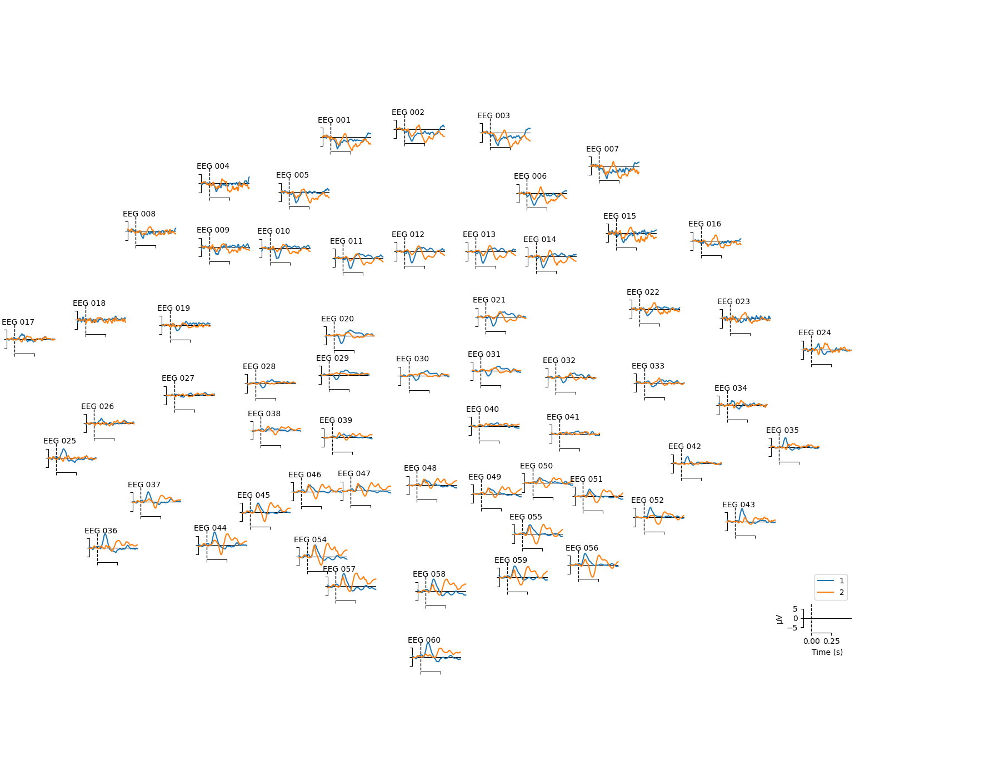
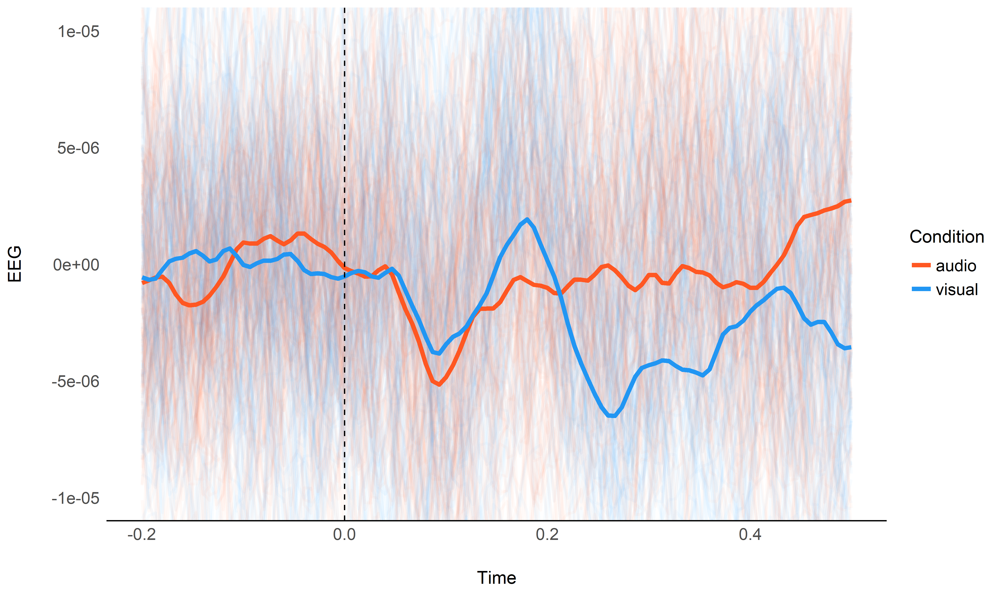
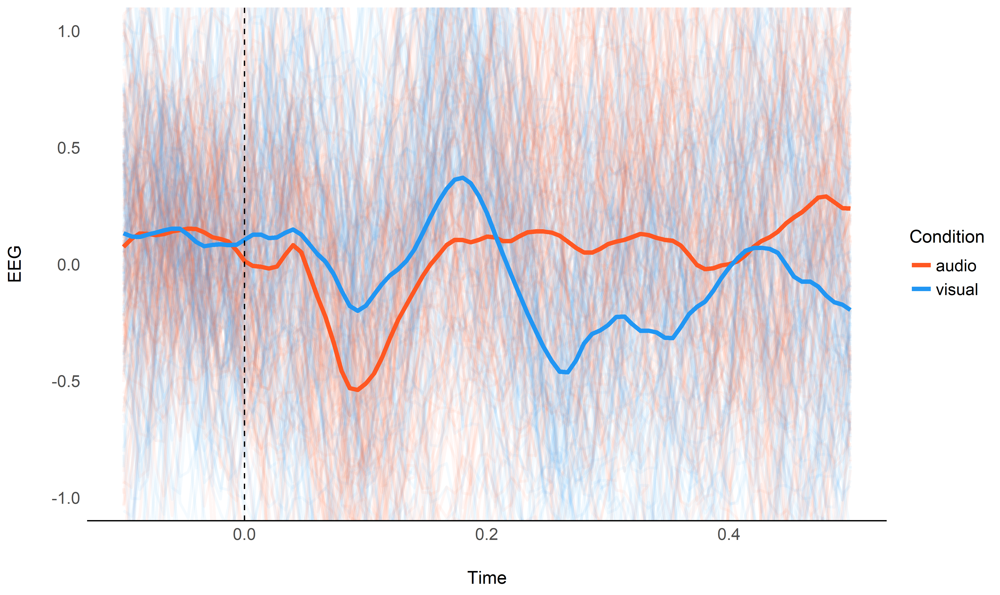

# An GAM-based Approach to EEG/ERP Analysis using Python and R

*This study can be referenced by* [citing the
package](https://github.com/neuropsychology/NeuroKit#citation).

**We’d like to publish this study, but unfortunately we currently don’t
have the time. If you want to help to make it happen, please contact
us\!**

## Introduction

The aim of this study is to show how to analyze event-related potentials
(ERP), i.e., evoked potentials using Bayesian General Additive Models
(GAM).

## Procedure

``` python
import pandas as pd
import neurokit2 as nk
import matplotlib.pyplot as plt
import mne

# Download example dataset
raw = mne.io.read_raw_fif(mne.datasets.sample.data_path() + '/MEG/sample/sample_audvis_filt-0-40_raw.fif')
events = mne.read_events(mne.datasets.sample.data_path() + '/MEG/sample/sample_audvis_filt-0-40_raw-eve.fif')

# Create epochs including different events
event_id = {'audio/left': 1, 'audio/right': 2,
            'visual/left': 3, 'visual/right': 4}

# Create epochs
epochs = mne.Epochs(raw, 
                    events,
                    event_id,
                    tmin=-0.2,
                    tmax=0.5,
                    picks='eeg',
                    preload=True,
                    baseline=(None, 0))

# Downsample
epochs = epochs.resample(sfreq=70)

# Generate list of evoked objects from conditions names
evoked = [epochs[name].average() for name in ('audio', 'visual')]

# Plot topo
mne.viz.plot_compare_evokeds(evoked, picks='eeg', axes='topo')
## [<Figure size 1800x1400 with 60 Axes>]
plt.savefig("figures/fig1.png")
plt.clf()

# Convert to data frame
data = nk.mne_to_df(epochs)

# Select subset of channels
df = data[['Label', 'Condition', 'Time',
           'EEG 001', 'EEG 002', 'EEG 003', 'EEG 004', 'EEG 005', 'EEG 006', 'EEG 007']]

# Save
df.to_csv("data.csv", index=False)
```



## Results

``` r
library(tidyverse)
library(easystats)
library(brms)

data <- read.csv("data.csv", stringsAsFactors = FALSE) %>% 
  mutate(Condition = str_remove(Condition, "/right"),
         Condition = str_remove(Condition, "/left"),
         EEG = rowMeans(select(., starts_with("EEG"))))
```

### Visualize

``` r
data %>% 
  group_by(Time, Condition) %>% 
  mutate(Average = mean(EEG)) %>% 
  ungroup() %>% 
  ggplot(aes(x=Time, y=EEG, color=Condition, group=Label)) +
  geom_line(size=1, alpha=0.03) +
  geom_line(aes(y=Average), size=1.5, alpha=1) +
  scale_color_manual(values=c("audio"="#FF5722", "visual"="#2196F3")) +
  coord_cartesian(ylim=c(-0.00001, 0.00001)) +
  
  # Theme EEG
  geom_vline(xintercept=0, linetype="dashed") +
  see::theme_modern() +
  theme(axis.line.y = element_blank())
```

<!-- -->

### Modelize using GAMs

``` r
# model <- brms::brm(EEG ~ s(Time, by=Condition) + (1|Label), data=data, algorithm ="meanfield")
# model <- rstanarm::stan_gamm4(EEG ~ Condition + s(Time, by=Condition), random = ~(1|Label), data=data, algorithm = "meanfield")
model <- lm(EEG ~ Condition * splines::bs(Time, df=0.03 * 700), data=data)
```

``` r
model %>% 
  modelbased::estimate_link() %>% 
  ggplot(aes(x=Time, y=Predicted)) +
  geom_ribbon(aes(ymin=CI_low, ymax=CI_high, fill=Condition), alpha=0.2) +
  geom_line(aes(color=Condition)) +
  scale_color_manual(values=c("audio"="#FF5722", "visual"="#2196F3")) +
  scale_fill_manual(values=c("audio"="#FF5722", "visual"="#2196F3")) +
  
  # Theme EEG
  geom_vline(xintercept=0, linetype="dashed") +
  see::theme_modern() +
  theme(axis.line.y = element_blank())
```

<!-- -->

## References
