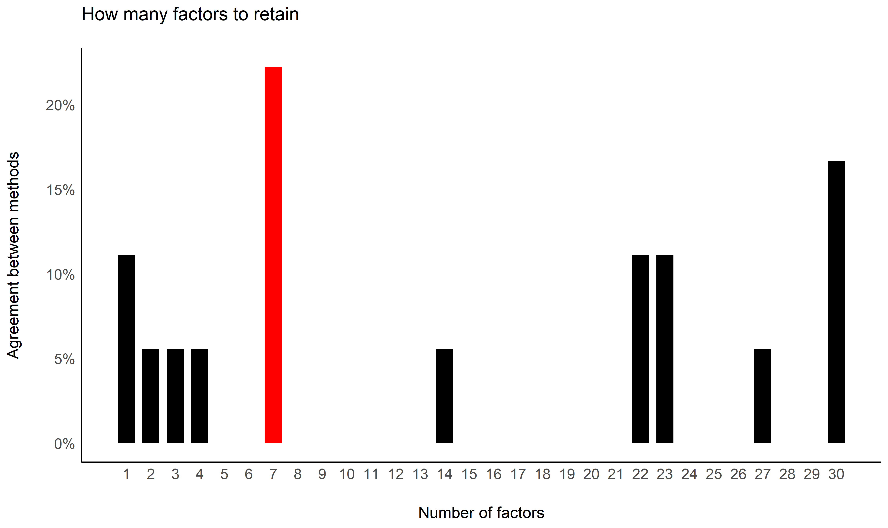
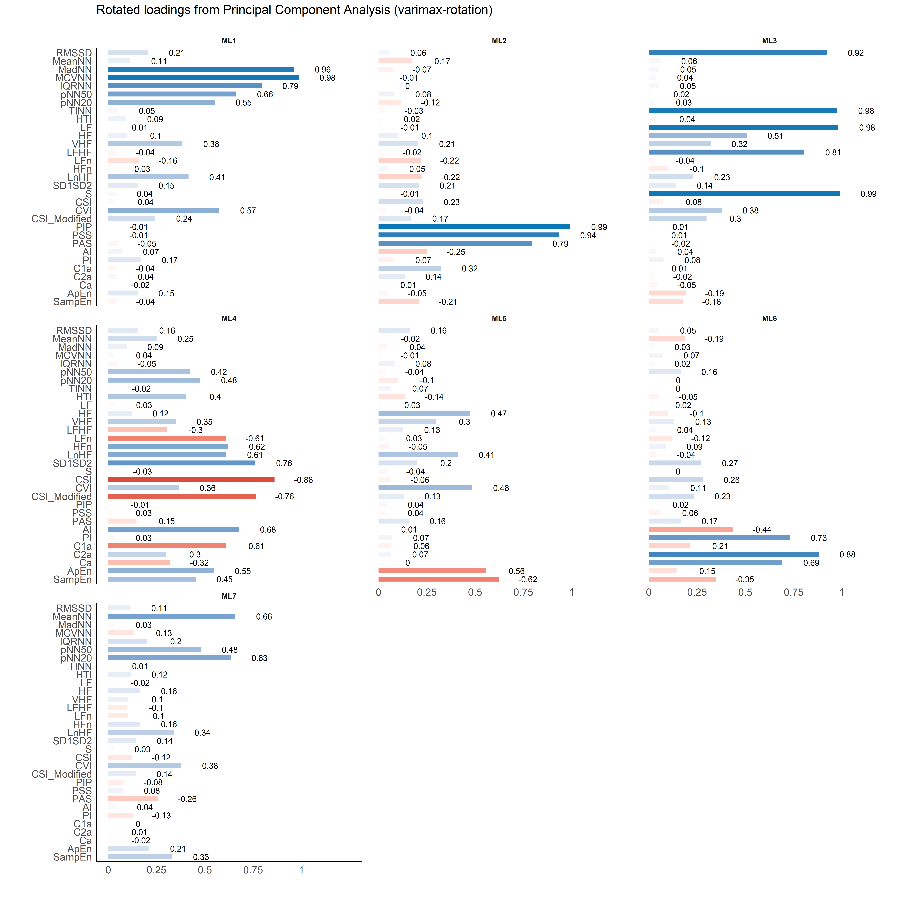

# The Structure of Indices of Heart Rate Variability (HRV)

*This study can be referenced by* [citing the
package](https://github.com/neuropsychology/NeuroKit#citation).

**We’d like to publish this study, but unfortunately we currently don’t
have the time. If you want to help to make it happen, please contact
us\!**

## Introduction

The aim of this study is to explore the factor structure of HRV indices.

## Databases

We used the same databases as in [this
study](https://github.com/neuropsychology/NeuroKit/tree/master/benchmarks/ecg_preprocessing#databases).

## Procedure

``` python
import pandas as pd
import numpy as np
import neurokit2 as nk

# Load True R-peaks location
rpeaks_gudb = pd.read_csv("../../data/gudb/Rpeaks.csv")
rpeaks_mit1 = pd.read_csv("../../data/mit_arrhythmia/Rpeaks.csv")
rpeaks_mit2 = pd.read_csv("../../data/mit_normal/Rpeaks.csv")

datafiles = [rpeaks_gudb, rpeaks_mit1, rpeaks_mit2]

# Get results
all_results = pd.DataFrame()

for file in datafiles:
    for database in np.unique(file["Database"]):
        data = file[file["Database"] == database]
        for participant in np.unique(data["Participant"]):
            data_participant = data[data["Participant"] == participant]
            sampling_rate = np.unique(data_participant["Sampling_Rate"])[0]
            rpeaks = data_participant["Rpeaks"].values

            results = nk.hrv(rpeaks, sampling_rate=sampling_rate)
            results["Participant"] = participant
            results["Database"] = database
            results["Recording_Length"] = rpeaks[-1] / sampling_rate / 60

            all_results = pd.concat([all_results, results], axis=0)

all_results.to_csv("data.csv", index=False)
```

## Results

``` r
library(tidyverse)
library(easystats)

data <- read.csv("data.csv", stringsAsFactors = FALSE) %>% 
  select(-HRV_ULF, -HRV_VLF)  # Empty
names(data) <- stringr::str_remove(names(data), "HRV_")
```

### Redundant Indices

#### Remove Equivalent (r \> .995)

``` r
data %>% 
  correlation::correlation() %>% 
  filter(r > 0.995) %>% 
  arrange(Parameter1, desc(abs(r)))
## Parameter1 | Parameter2 |    r |       95% CI |        t |  df |      p |  Method | n_Obs
## -----------------------------------------------------------------------------------------
## RMSSD      |       SDSD | 1.00 | [1.00, 1.00] | 47916.27 | 210 | < .001 | Pearson |   212
## RMSSD      |        SD1 | 1.00 | [1.00, 1.00] | 47916.27 | 210 | < .001 | Pearson |   212
## RMSSD      |       SD1d | 1.00 | [1.00, 1.00] |   502.01 | 210 | < .001 | Pearson |   212
## RMSSD      |       SD1a | 1.00 | [1.00, 1.00] |   434.71 | 210 | < .001 | Pearson |   212
## SD1        |       SD1d | 1.00 | [1.00, 1.00] |   502.34 | 210 | < .001 | Pearson |   212
## SD1        |       SD1a | 1.00 | [1.00, 1.00] |   434.49 | 210 | < .001 | Pearson |   212
## SD1d       |       SD1a | 1.00 | [1.00, 1.00] |   232.86 | 210 | < .001 | Pearson |   212
## SD2        |       SD2a | 1.00 | [1.00, 1.00] |   271.30 | 210 | < .001 | Pearson |   212
## SD2        |       SD2d | 1.00 | [1.00, 1.00] |   187.27 | 210 | < .001 | Pearson |   212
## SDNN       |      SDNNa | 1.00 | [1.00, 1.00] |   693.15 | 210 | < .001 | Pearson |   212
## SDNN       |      SDNNd | 1.00 | [1.00, 1.00] |   545.18 | 210 | < .001 | Pearson |   212
## SDNNd      |      SDNNa | 1.00 | [1.00, 1.00] |   307.31 | 210 | < .001 | Pearson |   212
## SDSD       |        SD1 | 1.00 | [1.00, 1.00] |      Inf | 210 | < .001 | Pearson |   212
## SDSD       |       SD1d | 1.00 | [1.00, 1.00] |   502.34 | 210 | < .001 | Pearson |   212
## SDSD       |       SD1a | 1.00 | [1.00, 1.00] |   434.49 | 210 | < .001 | Pearson |   212

data <- data %>% 
  select(-SDSD, -SD1, -SD1d, -SD1a) %>%  # Same as RMSSD 
  select(-SDNNd, -SDNNa) %>%  # Same as SDNN
  select(-SD2d, -SD2a)  # Same as SD2
```

#### Remove Strongly Correlated (r \> .99)

``` r
data %>% 
  correlation::correlation() %>% 
  filter(r > 0.99) %>% 
  arrange(Parameter1, desc(abs(r)))
## Parameter1 | Parameter2 |    r |       95% CI |      t |  df |      p |  Method | n_Obs
## ---------------------------------------------------------------------------------------
## GI         |         AI | 0.99 | [0.99, 1.00] | 133.76 | 210 | < .001 | Pearson |   212
## GI         |         SI | 0.99 | [0.99, 0.99] | 106.33 | 210 | < .001 | Pearson |   212
## RMSSD      |       CVSD | 0.99 | [0.99, 0.99] | 112.24 | 210 | < .001 | Pearson |   212
## SDNN       |        SD2 | 0.99 | [0.99, 0.99] | 111.13 | 210 | < .001 | Pearson |   212
## TINN       |         LF | 0.99 | [0.99, 0.99] | 104.44 | 210 | < .001 | Pearson |   212

data <- data %>% 
  select(-AI, -SI) %>%  # Same as GI 
  select(-SD2)  # Same as SDNN
```

### Recording Length

#### Investigate effect

``` r
correlation(data) %>% 
  filter(Parameter2 == "Recording_Length") %>% 
  arrange(desc(abs(r)))
```

#### Adjust the data for recording length

``` r
data <- effectsize::adjust(data, effect="Recording_Length") %>% 
  select(-Recording_Length)
```

### Gaussian Graphical Model

``` r
library(ggraph)

data %>% 
  correlation::correlation(partial=FALSE) %>% 
  correlation::cor_to_pcor() %>% 
  filter(abs(r) > 0.2) %>%
  tidygraph::as_tbl_graph(directed=FALSE) %>% 
  dplyr::mutate(closeness = tidygraph::centrality_closeness(normalized = TRUE),
                degree = tidygraph::centrality_degree(normalized = TRUE),
                betweeness = tidygraph::centrality_betweenness(normalized = TRUE)) %>%
  tidygraph::activate(nodes) %>%
  dplyr::mutate(group1 = as.factor(tidygraph::group_edge_betweenness()),
                # group2 = as.factor(tidygraph::group_optimal()),
                # group3 = as.factor(tidygraph::group_walktrap()),
                # group4 = as.factor(tidygraph::group_spinglass()),
                group5 = as.factor(tidygraph::group_louvain())) %>% 
  ggraph::ggraph(layout = "fr") +
    ggraph::geom_edge_arc(aes(colour = r, edge_width = abs(r)), strength = 0.1, show.legend = FALSE) +
    ggraph::geom_node_point(aes(size = degree, color = group5), show.legend = FALSE) +
    ggraph::geom_node_text(aes(label = name), colour = "white") +
    ggraph::scale_edge_color_gradient2(low = "#a20025", high = "#008a00", name = "r") +
    ggraph::theme_graph() +
    guides(edge_width = FALSE) +
    scale_x_continuous(expand = expansion(c(.10, .10))) +
    scale_y_continuous(expand = expansion(c(.10, .10))) +
    scale_size_continuous(range = c(20, 30)) +
    scale_edge_width_continuous(range = c(0.5, 2)) +
    see::scale_color_material_d(palette="rainbow", reverse=TRUE)
```

<!-- -->

Groups were identified using the
[tidygraph::group\_optimal](https://rdrr.io/cran/tidygraph/man/group_graph.html)
algorithm.

### Factor Analysis

#### How many factors

``` r
cor <- correlation::correlation(data[sapply(data, is.numeric)]) %>% 
  as.matrix()

n <- parameters::n_factors(data, cor=cor)

n
## # Method Agreement Procedure:
## 
## The choice of 8 dimensions is supported by 3 (21.43%) methods out of 14 (Optimal coordinates, Parallel analysis, Kaiser criterion).

plot(n) +
  theme_modern()
```

<!-- -->

#### Interpret

``` r
fa <- parameters::factor_analysis(data[sapply(data, is.numeric)], n=8, rotation="varimax")

print(fa, threshold="max", sort=TRUE)
## # Rotated loadings from Factor Analysis (varimax-rotation)
## 
## Variable     |  MR1 |   MR2 |   MR3 |  MR4 |  MR5 |  MR7 |   MR8 |  MR6 | Complexity | Uniqueness
## -------------------------------------------------------------------------------------------------
## S            | 0.99 |       |       |      |      |      |       |      |       1.01 |       0.01
## TINN         | 0.99 |       |       |      |      |      |       |      |       1.01 |   8.99e-03
## LF           | 0.98 |       |       |      |      |      |       |      |       1.03 |       0.02
## RMSSD        | 0.94 |       |       |      |      |      |       |      |       1.24 |   7.23e-03
## SDNN         | 0.94 |       |       |      |      |      |       |      |       1.25 |       0.02
## CVNN         | 0.93 |       |       |      |      |      |       |      |       1.29 |   3.52e-03
## CVSD         | 0.93 |       |       |      |      |      |       |      |       1.32 |  -8.55e-04
## LFHF         | 0.81 |       |       |      |      |      |       |      |       1.55 |       0.17
## ApEn         |      |  0.82 |       |      |      |      |       |      |       1.45 |       0.19
## SampEn       |      |  0.70 |       |      |      |      |       |      |       2.38 |       0.21
## HFn          |      |  0.65 |       |      |      |      |       |      |       1.71 |       0.45
## LFn          |      | -0.62 |       |      |      |      |       |      |       2.08 |       0.43
## CSI_Modified |      | -0.62 |       |      |      |      |       |      |       3.15 |       0.27
## HTI          |      |  0.60 |       |      |      |      |       |      |       1.36 |       0.57
## CSI          |      | -0.56 |       |      |      |      |       |      |       4.01 |       0.22
## C2d          |      |       | -0.85 |      |      |      |       |      |       1.49 |       0.11
## C2a          |      |       |  0.85 |      |      |      |       |      |       1.49 |       0.11
## Cd           |      |       | -0.84 |      |      |      |       |      |       1.34 |       0.17
## Ca           |      |       |  0.84 |      |      |      |       |      |       1.34 |       0.17
## PI           |      |       |  0.73 |      |      |      |       |      |       1.64 |       0.32
## PIP          |      |       |       | 0.99 |      |      |       |      |       1.05 |   4.71e-05
## IALS         |      |       |       | 0.98 |      |      |       |      |       1.09 |   1.19e-03
## PSS          |      |       |       | 0.88 |      |      |       |      |       1.08 |       0.19
## PAS          |      |       |       | 0.76 |      |      |       |      |       1.57 |       0.28
## MCVNN        |      |       |       |      | 0.95 |      |       |      |       1.08 |       0.05
## MadNN        |      |       |       |      | 0.94 |      |       |      |       1.07 |       0.09
## IQRNN        |      |       |       |      | 0.82 |      |       |      |       1.41 |       0.20
## pNN50        |      |       |       |      | 0.65 |      |       |      |       3.00 |       0.17
## pNN20        |      |       |       |      | 0.51 |      |       |      |       3.90 |       0.13
## VHF          |      |       |       |      |      | 0.67 |       |      |       2.17 |       0.31
## LnHF         |      |       |       |      |      | 0.65 |       |      |       3.72 |       0.10
## CVI          |      |       |       |      |      | 0.63 |       |      |       3.55 |       0.07
## HF           |      |       |       |      |      | 0.60 |       |      |       2.28 |       0.32
## SD1SD2       |      |       |       |      |      | 0.58 |       |      |       2.99 |       0.19
## C1a          |      |       |       |      |      |      | -0.87 |      |       1.54 |       0.05
## C1d          |      |       |       |      |      |      |  0.87 |      |       1.54 |       0.05
## GI           |      |       |       |      |      |      |  0.57 |      |       3.41 |       0.11
## MeanNN       |      |       |       |      |      |      |       | 0.91 |       1.38 |       0.02
## MedianNN     |      |       |       |      |      |      |       | 0.85 |       1.54 |       0.10
## 
## The 8 latent factors (varimax rotation) accounted for 84.97% of the total variance of the original data (MR1 = 20.29%, MR2 = 12.03%, MR3 = 10.84%, MR4 = 10.44%, MR5 = 9.95%, MR7 = 7.75%, MR8 = 6.99%, MR6 = 6.68%).

plot(fa)
```

<!-- -->

### Cluster Analysis

#### How many clusters

<!-- ```{r, message=FALSE, warning=FALSE} -->

<!-- parameters::n_clusters(data, package = "all") -->

<!-- ``` -->

#### Interpret

## References
